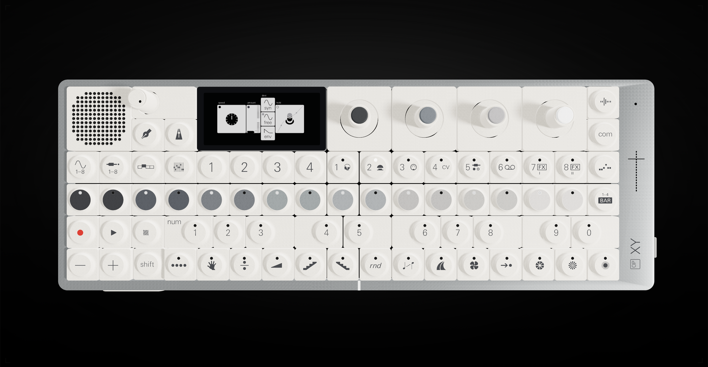

# OP-XY in light aluminium

A fan recolour of Mitch Ivin's interactive OP-XY, in the pale finish
of the OP-1, TX-6 and TP-7.

Original project: [mitchivin/te-opxy](https://github.com/mitchivin/te-opxy)
by [Mitch Ivin](https://mitchivin.com/). The 3D device, screen, songs and
controls are his work. I changed only the materials and lighting,
with help from Codex.

## What's changed

- Encoder islands, encoder hardware, speaker panel, underside and feet: warm off-white
- Outer frame: textured light aluminium
- Underside emblem: glossy white; underside print and button symbols: dark grey
- Speaker grille: dark interior walls and backing
- Lighting: stronger top-right key light, reduced fill, device halo off

## Run locally

This is a static site. From the repository folder, run:

    python3 -m http.server 8000

Then open `http://localhost:8000`. The light finish loads by default;
the theme button switches to the original dark one.

## Credits

Not affiliated with or endorsed by Teenage Engineering.
OP-XY, OP-1, TX-6 and TP-7 are trademarks of Teenage Engineering.
